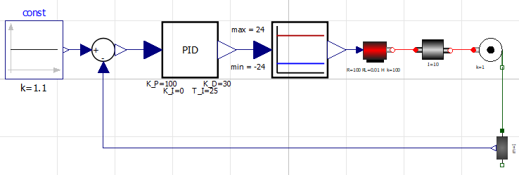

# modelica_pid_library
Simple control library for Modelica, that includes a position control example (crane).

## Aim of this project
This project was part of the exam in the course "Multidisziplinäre Modellierung mit Modelica" at FH-Bielefeld. This course was part of my master studies at Bielefeld University. I decide to make a control library because of my background in this topic. But the aims of this project are:

* Create a library in Openmodelica
* Object orientated modeling
* Use of different Modelica paradigm:
    - Basic Modelica syntax
    - Event handling
    - Initialisation of a model
* Create an example model

The example model is a position control of a dc motor. Its rotary movement is translated into a linear position. Because you can activate and deactivate the gravity of the "inertia_trans" model (Mass that can only be moved in translation) it could be a crane or a linear mover. My real-world inspiration was a crane. So I call this example model "crane". 

This is the schematic view of the crane:

## How to use it

The libraries "SimpleElectric" and "SimpleMechanic" are dependencies for the example that is stored in the control library. They created by me in the practical exercises at this course. So during the creation of both libraries, I was instructed.

* Open the OpenModelica Connection Editor (I used Version 1.13.2 for Windows)
* Load all three libraries that are stored in this repository
* Navigate to the "Examples" package of the Control-Library and open the crane-model
* Check the parameters of the used elements in the schematic view
* Simulate the model and feel free to change the control parameters

